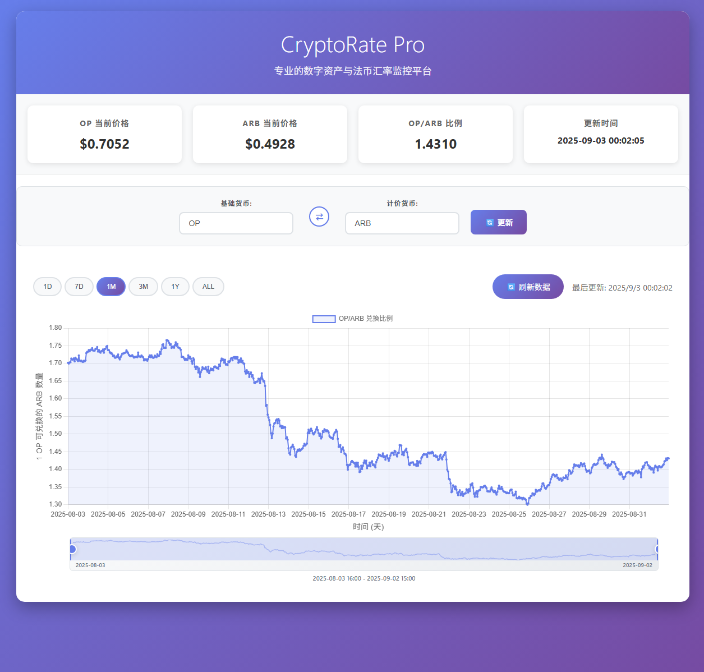

# CryptoRate Pro 🚀

专业的数字资产与法币汇率监控平台，支持实时汇率查询、历史图表展示和多种货币对交易。

 
 
 


<!-- Project screenshot (shown on GitHub repo homepage) -->
<p align="center">
   
  
</p>

## ✨ 功能特性

### 🌐 多货币支持
- **法币** (12种): USD, CNY, EUR, JPY, GBP, KRW, CAD, AUD, CHF, HKD, SGD, INR
- **加密货币** (30+种): BTC, ETH, BNB, SOL, ADA, ARB, OP, POL, AVAX 等主流币种
- **稳定币**: USDT, USDC 等

### 📈 实时数据
- 实时汇率查询和显示
- 支持加密货币↔法币、法币↔法币、加密货币↔加密货币
- 数据来源：Binance API + ExchangeRate API

### 📊 历史图表
- 多时间跨度：1天、7天、30天、90天、1年、全部
- 交互式图表，支持缩放和时间范围选择
- 可视化价格趋势分析

### 🎨 现代化界面
- 响应式设计，支持移动设备
- 直观的用户界面
- 智能货币对输入系统
- 一键货币对反转功能

## 🔧 技术架构

### 后端技术栈
- **Web框架**: Flask 2.3.3
- **数据处理**: Pandas 2.1.1
- **HTTP客户端**: Requests 2.31.0
- **WSGI服务器**: Gunicorn 21.2.0

### 前端技术栈
- **图表库**: Chart.js
- **样式**: 现代CSS3 + 渐变设计
- **交互**: 原生JavaScript (ES6+)

### 部署架构
- **反向代理**: Nginx
- **进程管理**: Systemd
- **监控**: 自定义监控脚本
- **日志**: Journald + 文件日志

## 🚀 快速开始

### 本地快速运行（免部署）

无需安装 Nginx 或 systemd，直接在本机运行：

Windows（PowerShell）：
```powershell
py -3 -m venv venv
.\venv\Scripts\Activate.ps1
pip install -r requirements.txt
python app.py
# 访问（开发服务器默认端口）：http://127.0.0.1:5001
```

Linux / macOS：
```bash
python3 -m venv venv
source venv/bin/activate
pip install -r requirements.txt
python app.py
# 访问（开发服务器默认端口）：http://127.0.0.1:5001
```

可选（生产风格运行，使用 Gunicorn，端口 5008）：
```bash
gunicorn --bind 0.0.0.0:5008 app:app
# 访问：http://127.0.0.1:5008
```

### 一键部署（树莓派/Debian）

```bash
curl -o deploy.sh https://raw.githubusercontent.com/eizawa/crypto-chart/main/deploy.sh
chmod +x deploy.sh
./deploy.sh
```

### Docker 部署（即将支持）

```bash
docker run -d -p 5008:5008 --name crypto-chart eizawa/crypto-chart:latest
```

### 手动安装

1. **克隆项目**
   ```bash
   git clone https://github.com/eizawa/crypto-chart.git
   cd crypto-chart
   ```

2. **安装依赖**
   ```bash
   python3 -m venv venv
   source venv/bin/activate
   pip install -r requirements.txt
   ```

3. **启动应用**
   ```bash
   python app.py
   # 或使用 gunicorn
   gunicorn --bind 0.0.0.0:5008 app:app
   ```

4. **访问应用**
   - 如果运行的是 `python app.py`（开发服务器）：访问 http://127.0.0.1:5001
   - 如果运行的是 `gunicorn --bind 0.0.0.0:5008 app:app`：访问 http://127.0.0.1:5008

## 📖 详细文档

- [📋 安装指南](INSTALL.md) - 快速安装步骤
- [🔧 部署文档](DEPLOYMENT.md) - 完整部署和配置指南
- [🔍 API文档](API.md) - API接口说明（即将更新）

## 🛠️ 运维管理

### 服务管理
```bash
# 查看服务状态
sudo systemctl status crypto-chart

# 重启服务
sudo systemctl restart crypto-chart

# 查看日志
journalctl -u crypto-chart -f
```

### 应用更新
```bash
# 执行自动更新
./update_crypto_chart.sh

# 查看更新选项
./update_crypto_chart.sh --help
```

### 系统监控
```bash
# 完整系统监控
./monitor.sh

# 简单状态检查
./monitor.sh status

# 系统资源检查
./monitor.sh resources
```

## 🌐 访问地址

部署完成后可通过以下方式访问：

- **直接访问**: `http://你的IP:5008`
- **Nginx代理**: `http://你的IP` (如果配置了Nginx)
- **本地访问**: `http://localhost:5008`

- 📈 实时显示最近30天的OP/ARB兑换比例走势图
- 💰 显示当前OP和ARB的实时价格
- 🔄 自动刷新功能，保持数据最新
- 📱 响应式设计，支持手机和桌面设备
- 🌐 基于币安API，数据权威可靠

## 安装和运行

### 1. 安装依赖

```bash
pip install -r requirements.txt
```

### 2. 运行应用

```bash
python app.py
```

### 3. 访问应用

在浏览器中打开: http://127.0.0.1:5001/

## 项目结构

```
op-arb-chart/
├── app.py              # Flask后端应用
├── requirements.txt    # Python依赖包
├── README.md          # 项目说明
└── templates/
    └── index.html     # 前端HTML页面
```

## API接口

- `GET /` - 主页面
- `GET /api/data` - 获取历史价格数据和比例走势
- `GET /api/current` - 获取当前实时价格和比例

## 技术栈

- **后端**: Python + Flask
- **前端**: HTML + CSS + JavaScript
- **图表**: Chart.js
- **数据源**: 币安(Binance) API

## 注意事项

- 确保网络连接正常，应用需要访问币安API
- 数据更新频率为实时，图表每次刷新都会获取最新数据
- 如遇到API限制，可适当增加请求间隔

## 故障排除

如果遇到数据加载失败：
1. 检查网络连接
2. 确认币安API可正常访问
3. 查看控制台错误信息
4. 尝试刷新页面

